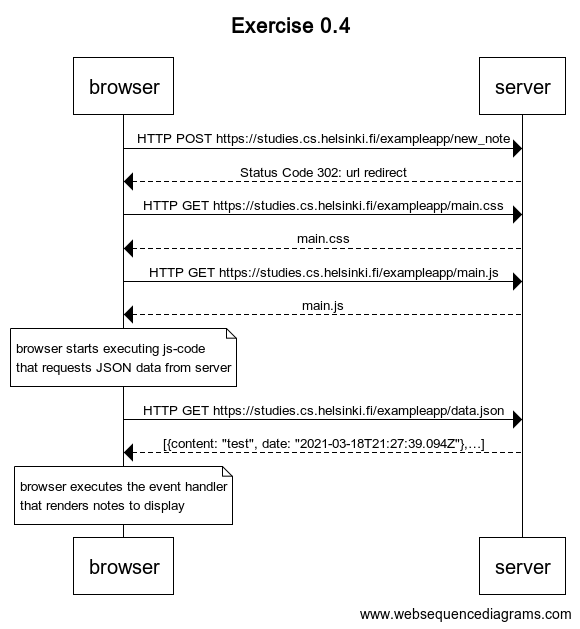
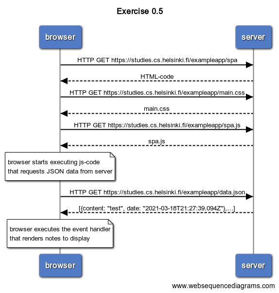
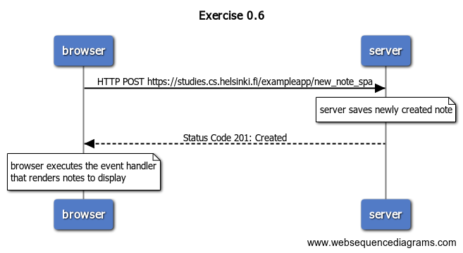

# Fundamentals of Web Apps (Notes)

[Course Content](https://fullstackopen.com/en/part0/fundamentals_of_web_apps)

* Developer Console:
  * `F12` or `option-cmd-i` (macOS)
  * `F12` or `ctrl-shift-i` (Windows or Linux)
  * Check *Disable cache* in *Network* tab
  * Check *Preserve log* in *Network* tab

## HTTP

* HTTP: Hypertext Transfer Protocol (HTTP) is designed to enable communications between clients and servers
  * Methods: 
    * GET: is used to request data from a specified resource
    * POST: is used to send data to a server to create/update a resource
    * PUT
    * HEAD
    * DELETE
    * PATCH
    * OPTIONS
    * The two most common HTTP methods are: GET and POST

### GET Example

[Example](https://studies.cs.helsinki.fi/exampleapp/)

Chain of events:

* Browser does HTTP GET request to the server to fetch the HTML code of the page
  * The *img* tag in the HTML prompts the browser to fetch the image *kuva.png*.
    * The browser renders the HTML page and the image to the screen

### Loading a page containing JS

[Example](https://studies.cs.helsinki.fi/exampleapp/notes)

Chain of events:

- The browser fetches the HTML code defining the content and the structure of the page from the server using an HTTP GET request.
  - Links in the HTML code cause the browser to also fetch the CSS style sheet *main.css* and a JavaScript code file *main.js*
    - The browser executes the JavaScript code. The code makes an HTTP GET request to the address https://studies.cs.helsinki.fi/exampleapp/data.json, which returns the notes as JSON data.
      - When the data has been fetched, the browser executes an *event handler*, which renders the notes to the page using the DOM-API.
      - The **Document Object Model** (**DOM**) connects web pages to scripts or programming languages by representing the structure of a document—such as the HTML representing a web page—in memory.

### POST + GET Example

Example: User creates a new note on page https://studies.cs.helsinki.fi/exampleapp/notes by writing something into the text field and clicking the *submit* button.

Chain of events:

### Single Page App

Example: User goes to the [single page app](https://fullstackopen.com/en/part0/fundamentals_of_web_apps#single-page-app) version of the notes app at https://studies.cs.helsinki.fi/exampleapp/spa.

Chain of events:

Example: User creates a new note using the single page version of the app (https://studies.cs.helsinki.fi/exampleapp/spa).

Chain of events:

