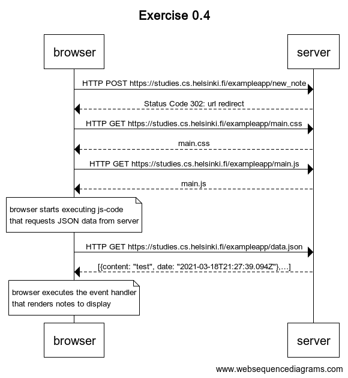
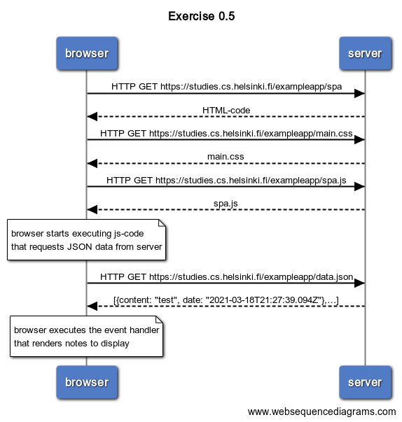
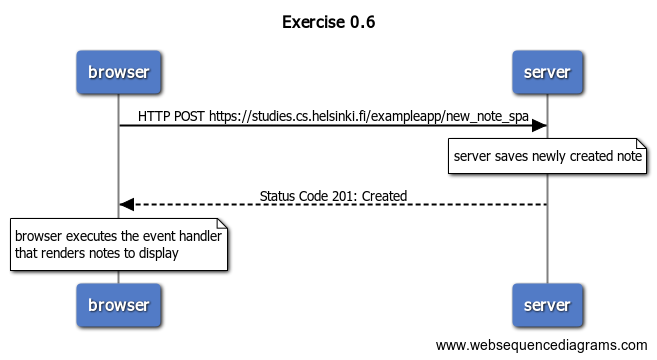

# Exercises

## 0.4

User creates a new note on page https://studies.cs.helsinki.fi/exampleapp/notes by writing something into the text field and clicking the _submit_ button.

Chain of events:

## 0.5

User goes to the [single page app](https://fullstackopen.com/en/part0/fundamentals_of_web_apps#single-page-app) version of the notes app at https://studies.cs.helsinki.fi/exampleapp/spa.

Chain of events:

## 0.6

User creates a new note using the single page version of the app (https://studies.cs.helsinki.fi/exampleapp/spa).

Chain of events:

